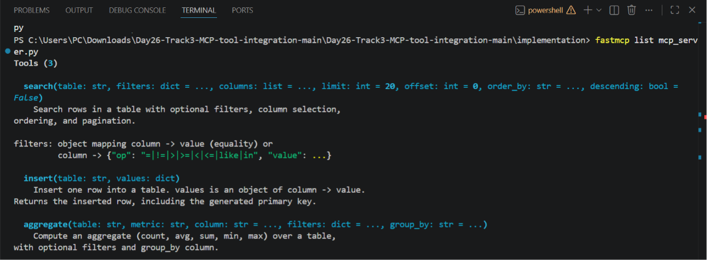
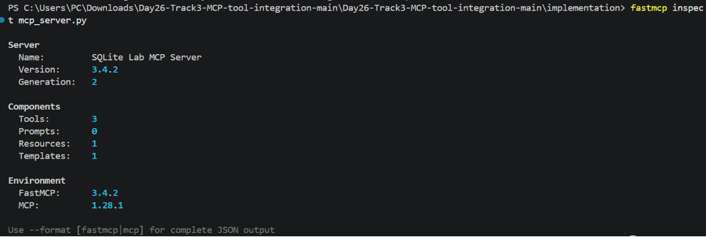
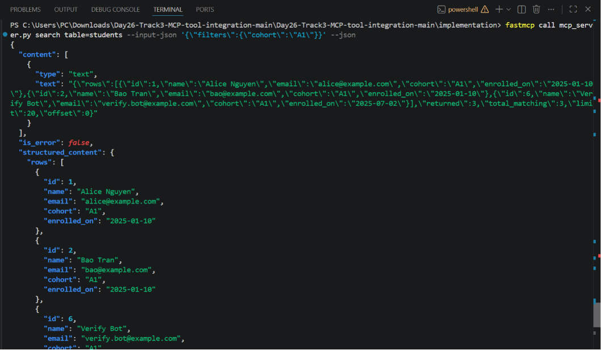
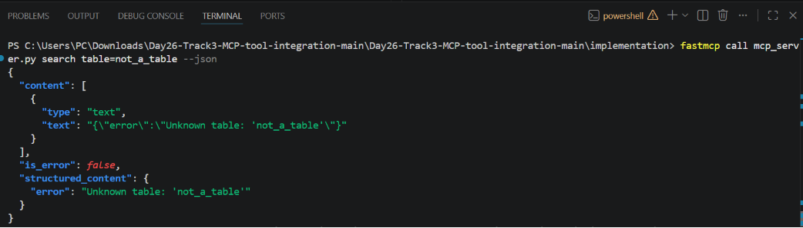
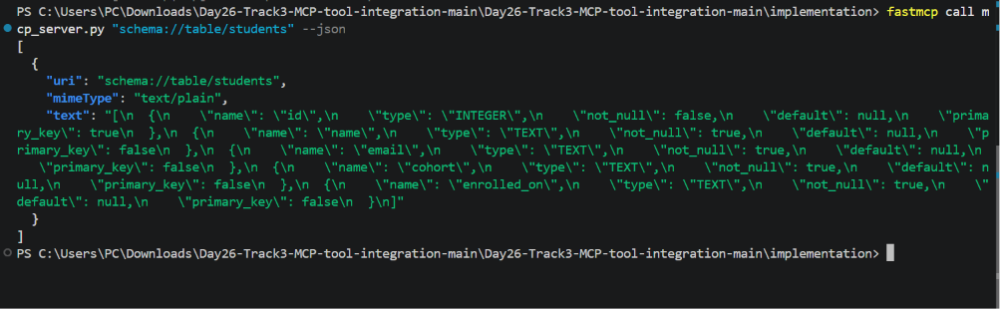
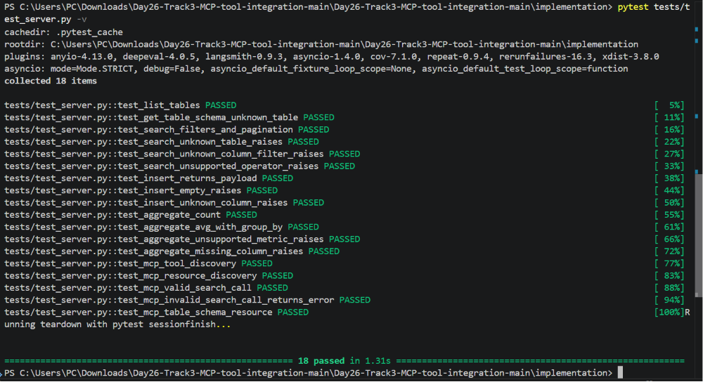
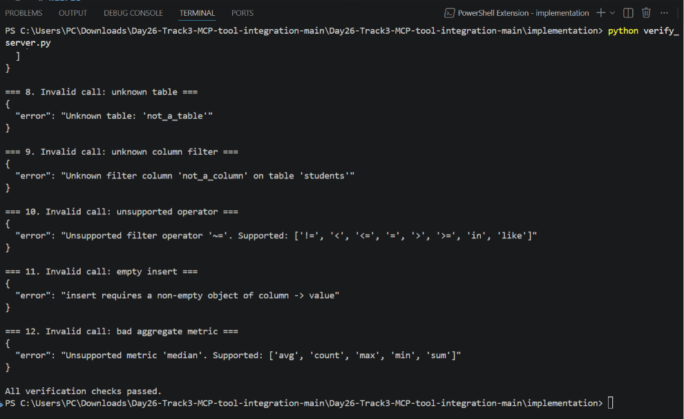
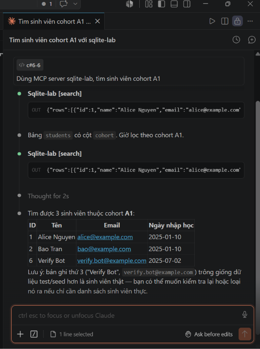

# SQLite Lab MCP Server

A [FastMCP](https://gofastmcp.com/) server that exposes a small `students` /
`courses` / `enrollments` SQLite database through three MCP tools
(`search`, `insert`, `aggregate`) and two MCP resources (full schema + a
per-table schema template).

## Project structure

```text
implementation/
  db.py              # SQLiteAdapter: validated, parameterized DB access
  init_db.py          # creates + seeds lab.db (reproducible)
  mcp_server.py        # FastMCP server: tools + resources
  verify_server.py     # scripted end-to-end verification (rubric checklist)
  tests/test_server.py # pytest suite (adapter unit tests + MCP client tests)
  requirements.txt
  .mcp.json            # example Claude Code client config
  start_inspector.sh / .ps1
```

## Data model

- `students(id, name, email, cohort, enrolled_on)`
- `courses(id, title, department, credits)`
- `enrollments(id, student_id, course_id, term, score)`

## Setup

```bash
cd implementation
python -m venv .venv        # optional but recommended
pip install -r requirements.txt
python init_db.py           # creates lab.db with schema + seed data
```

`init_db.py` is safe to re-run: it drops and recreates `lab.db` so the
dataset is always reproducible.

## Tools

### `search(table, filters=None, columns=None, limit=20, offset=0, order_by=None, descending=False)`

Filtered, paginated row lookup.

- `filters`: `{"column": value}` for equality, or
  `{"column": {"op": "=|!=|>|>=|<|<=|like|in", "value": ...}}` for other
  operators.
- Rejects unknown tables, unknown columns, and unsupported operators.

Example: search all students in cohort `A1`

```json
{"table": "students", "filters": {"cohort": "A1"}}
```

### `insert(table, values)`

Inserts one row (`values` is a `{"column": value}` object) and returns the
inserted row including the generated primary key. Rejects empty payloads and
unknown columns.

Example: insert a new student

```json
{"table": "students", "values": {"name": "Nam Le", "email": "nam@example.com", "cohort": "A1", "enrolled_on": "2025-07-02"}}
```

### `aggregate(table, metric, column=None, filters=None, group_by=None)`

Supports `count`, `avg`, `sum`, `min`, `max`, with optional `filters` and
`group_by`. `count` may omit `column` (counts all rows); the other metrics
require a valid numeric column.

Example: average score by course

```json
{"table": "enrollments", "metric": "avg", "column": "score", "group_by": "course_id"}
```

## Resources

- `schema://database` — JSON schema for every table.
- `schema://table/{table_name}` — JSON schema for a single table (e.g.
  `schema://table/students`); returns a clear error payload for an unknown
  table name.

## Validation and safety

All SQL is built in `db.py` (`SQLiteAdapter`) using an allow-list approach:

- table names are checked against `sqlite_master`
- column names are checked against `PRAGMA table_info(table)`
- filter operators are checked against a fixed `SUPPORTED_OPERATORS` map
- aggregate metrics are checked against a fixed `SUPPORTED_METRICS` set
- all values are passed as bound `?` parameters — never string-interpolated
- empty inserts are rejected before any SQL is built

Invalid requests raise `ValidationError`, which the MCP tool wrappers in
`mcp_server.py` catch and turn into a `{"error": "..."}` payload instead of
letting an exception or raw SQL error reach the client.

## Testing and verification

Run the automated test suite (adapter unit tests + end-to-end MCP client
tests, each using an isolated temp database):

```bash
python -m pytest tests/test_server.py -v
```

Run the scripted verification walkthrough (tool discovery, resource
discovery, valid calls, invalid calls with clear errors):

```bash
python verify_server.py
```

### Inspecting the server with the `fastmcp` CLI

The lab's Goal section allows "Inspector or equivalent tooling" for manual
verification. The `fastmcp` CLI (installed with `fastmcp`, no Node/npx
required) covers the same checklist and is used here as the primary
interactive verification tool:

```bash
# discover tools with their schemas
fastmcp list mcp_server.py

# summary of tools / resources / templates exposed
fastmcp inspect mcp_server.py

# valid call
fastmcp call mcp_server.py search table=students --input-json '{"filters":{"cohort":"A1"}}' --json

# invalid call -> clear error payload, not a crash
fastmcp call mcp_server.py search table=not_a_table --json

# read a resource
fastmcp call mcp_server.py "schema://table/students" --json
```

> **Windows PowerShell note:** PowerShell 5.1 strips unescaped `"`
> characters when passing arguments to a native executable, even inside a
> single-quoted string — so the `--input-json` example above arrives as
> invalid JSON (`{filters:{cohort:A1}}`) and `fastmcp` fails with
> `Expecting property name enclosed in double quotes`. Escape the inner
> quotes with `\"` instead:
>
> ```powershell
> fastmcp call mcp_server.py search table=students --input-json '{\"filters\":{\"cohort\":\"A1\"}}' --json
> ```

Checklist covered by the commands above:

- `search`, `insert`, `aggregate` appear with schemas (`fastmcp list`)
- `schema://database` and `schema://table/{table_name}` appear as resources
  (`fastmcp inspect`)
- a valid call (e.g. `search` on `students`) returns rows
- an invalid call (e.g. `search` on a missing table) returns a clear error

### MCP Inspector (optional)

`start_inspector.sh` / `start_inspector.ps1` are also provided to launch the
official [MCP Inspector](https://modelcontextprotocol.io/docs/tools/inspector)
web UI:

```bash
./start_inspector.sh        # macOS/Linux/WSL
./start_inspector.ps1       # Windows PowerShell
```

> Note: on some Windows setups the Inspector's Node-based STDIO proxy can
> time out on `initialize` even though the server itself starts and responds
> correctly (verified independently via `fastmcp`/pytest above). If
> Inspector doesn't connect on your machine, the `fastmcp` CLI commands
> above are a fully equivalent substitute per the lab's own requirements.

## Demo

Screenshots covering the full rubric verification checklist — tool/resource
discovery, valid and invalid tool calls, the automated test suite, the
scripted verification walkthrough, and a live client connection.

**Tool discovery** — `fastmcp inspect mcp_server.py --format fastmcp` shows
the three tools (`search`, `insert`, `aggregate`) with their input schemas.



**Resource discovery** — `schema://database` and the
`schema://table/{table_name}` template are both exposed.



**Valid call** — `search` returns students in cohort `A1`.



**Invalid call** — an unknown table/column/operator returns a clear
`{"error": ...}` payload instead of crashing.



**Schema resource read** — `schema://table/students` returns the table's
column definitions.



**Automated tests** — `pytest tests/test_server.py -v` passes all 18 tests
(adapter unit tests + end-to-end MCP client tests).



**Scripted verification** — `python verify_server.py` walks through the full
rubric checklist end-to-end and prints `All verification checks passed.`



**Client connection** — a live MCP client (Claude Code) connected to
`sqlite-lab` and running a real query.



## Client configuration

### Claude Code

`.mcp.json` (included in this folder — update the paths for your machine):

```json
{
  "mcpServers": {
    "sqlite-lab": {
      "type": "stdio",
      "command": "/ABSOLUTE/PATH/TO/python",
      "args": ["/ABSOLUTE/PATH/TO/implementation/mcp_server.py"],
      "env": {}
    }
  }
}
```

Claude Code can also read resources directly, e.g.
`@sqlite-lab:schema://database`.

### Gemini CLI

```bash
gemini mcp add sqlite-lab /ABSOLUTE/PATH/TO/python /ABSOLUTE/PATH/TO/implementation/mcp_server.py --description "SQLite lab FastMCP server" --timeout 10000
gemini mcp list
gemini --allowed-mcp-server-names sqlite-lab --yolo -p "Use the sqlite-lab MCP server and show me the top 2 students by score."
```

### Codex

`~/.codex/config.toml`:

```toml
[mcp_servers.sqlite_lab]
command = "/ABSOLUTE/PATH/TO/python"
args = ["/ABSOLUTE/PATH/TO/implementation/mcp_server.py"]
```

## Demo checklist

1. `python init_db.py` — fresh database
2. `python -m pytest tests/test_server.py -v` — all tests pass
3. `python verify_server.py` — full checklist walkthrough with output
4. `fastmcp list mcp_server.py` / `fastmcp inspect mcp_server.py` — show the
   three tools + resources are discoverable; `fastmcp call` a valid and an
   invalid request
5. Connect one client (Claude Code / Gemini CLI / Codex) and run a live
   query end-to-end (e.g. "search all students in cohort A1")
